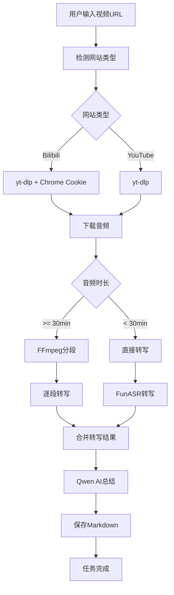

# Video Summarizer

AI-powered video analysis tool that automatically downloads, transcribes, and summarizes video content from Bilibili and YouTube.

## Features

- **Video Download**: Automatically download videos from Bilibili and YouTube
- **Audio Transcription**: Convert video audio to text using FunASR (Paraformer model)
- **AI Summarization**: Generate structured summaries using Qwen AI model
- **Long Video Support**: Automatic segmentation for videos over 30 minutes
- **Task Management**: Track and manage multiple summarization tasks
- **Search & Filter**: Search tasks by title, URL, or error messages

## Tech Stack

| Category | Technology |
|----------|------------|
| Frontend | React 18, TypeScript, Tailwind CSS |
| Desktop | Electron 33 |
| Build | Vite, electron-builder |
| Video Download | yt-dlp |
| Audio Processing | FFmpeg |
| Transcription | FunASR (Paraformer + VAD + Punctuation) |
| AI Summary | Qwen (via DashScope API) |

## Architecture



## Quick Start

### Prerequisites

- macOS
- Node.js 18+
- Python 3.10+
- FFmpeg
- Chrome browser (for Bilibili Cookie)
- yt-dlp (installed via pipx)

### Installation

```bash
# Clone the repository
git clone <repo-url>
cd video-summarizer-D

# Install dependencies
npm install

# Build for Electron
npm run build:electron
```

### Usage

1. Open the application
2. Paste a Bilibili or YouTube video URL
3. Click "开始分析"
4. Wait for download, transcription, and summarization
5. View and download the generated summary

### Cookie Setup (Bilibili Only)

Bilibili requires authentication. The app will automatically read cookies from your Chrome browser. Make sure you're logged into Bilibili in Chrome.

## File Structure

```
video-summarizer-D/
├── electron/
│   ├── main.ts          # Electron main process
│   └── preload.ts        # Preload script
├── src/
│   ├── App.tsx          # Main React component
│   ├── config.ts        # Configuration
│   ├── main.tsx         # React entry
│   └── index.css        # Styles
├── dist/                # Built frontend
├── dist-electron/       # Built Electron code
├── release/             # Packaged application
├── package.json
├── vite.config.ts
└── tailwind.config.js
```

## FAQ

**Q: YouTube videos require authentication?**
A: No, YouTube videos can be downloaded without authentication.

**Q: Bilibili download fails?**
A: Make sure you're logged into Bilibili in Chrome browser. The app reads cookies from Chrome's default profile.

**Q: Long videos take too long?**
A: Videos over 30 minutes are automatically segmented. Total time depends on video length and server load.

**Q: Where are summaries saved?**
A: Summaries are saved in the application data directory under `summaries/`.

## Contributing

1. Fork the repository
2. Create a feature branch
3. Make your changes
4. Submit a pull request

## License

MIT License
